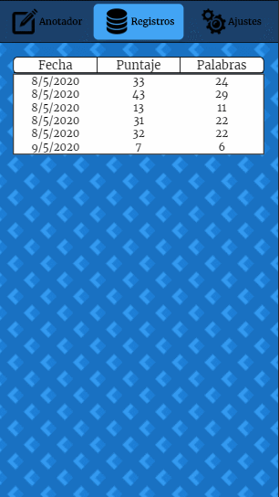
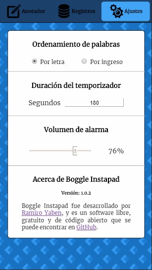

# Boggle Instapad

<div display='flex' justify-content='center'></div>

## Qué es esta app

¿Te cansaste de escribir las palabras con lapicera y desperdiciar montones de hojas de papel que se pierden constantemente? ¿Te molesta tachar a mano, contar las letras de las palabras para poder saber sus puntos y después tener que contarlos? ¿Te gusta conservar estadísticas, y de esta manera se hace muy difícil? Si sos una persona que se divierte con *Boggle*, el clásico juego de mesa de armado de palabras, sabés y entendés de qué se trata todo esto. <ins>Boggle Instapad</ins> es una solución digital que te permite seguir disfrutando del concepto **físico** de Boggle (usar y mezclar el tablero con los dados) pero te otorga herramientas como un anotador de palabras, cálculo automático de puntos, tachado sencillo, historial de partidas, temporizador incorporado y otras configuraciones. Es un agregado que hace de la experiencia de juego algo mucho más completo, ameno, sencillo y hasta ecológico.

## Descargar

Podés descargar Boggle Instapad de diferentes maneras.

* Obteniendo el código fuente a través de una terminal (si tenés instalado Git):

```
git clone https://github.com/ryaben/boggle-instapad.git
```

* <a href='https://mega.nz/file/R9EkzS4I#rjseLcK61jfaSdwVlvhwpr6irBtWJb5cr-nzcFllIZE'>Instalando el .apk</a> en tu celular, tablet o cualquier dispositivo con Android:
